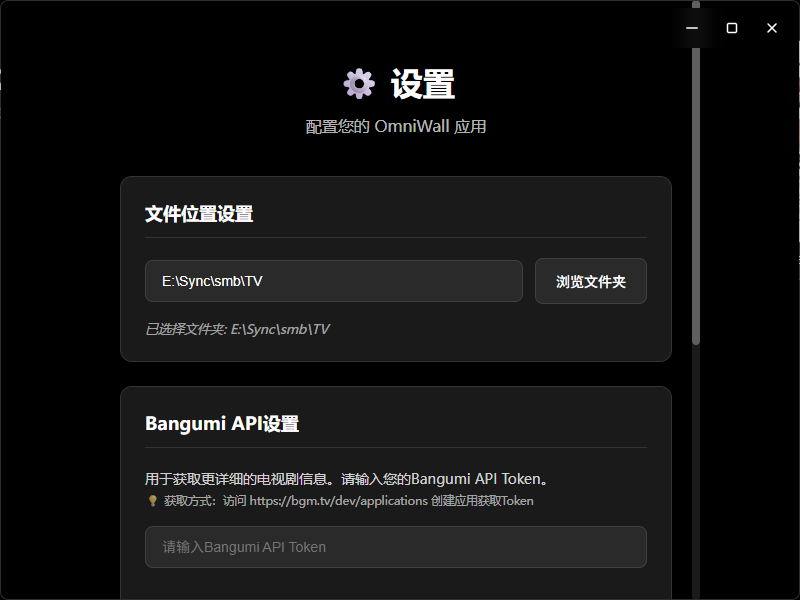
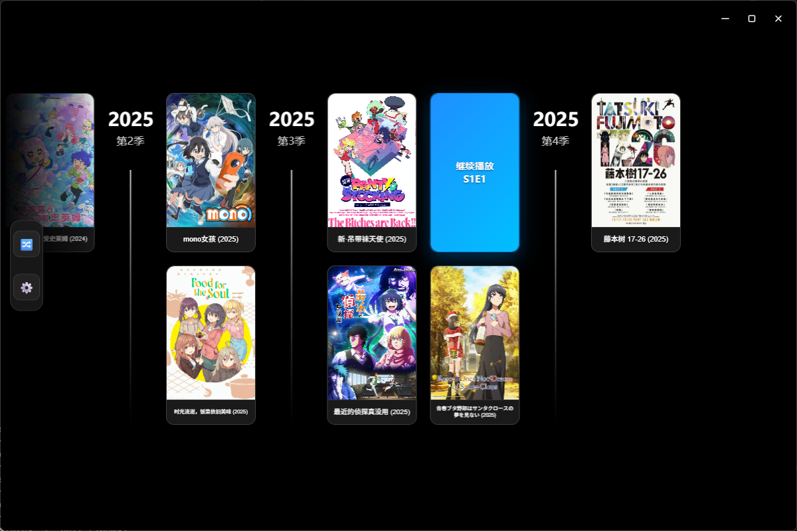
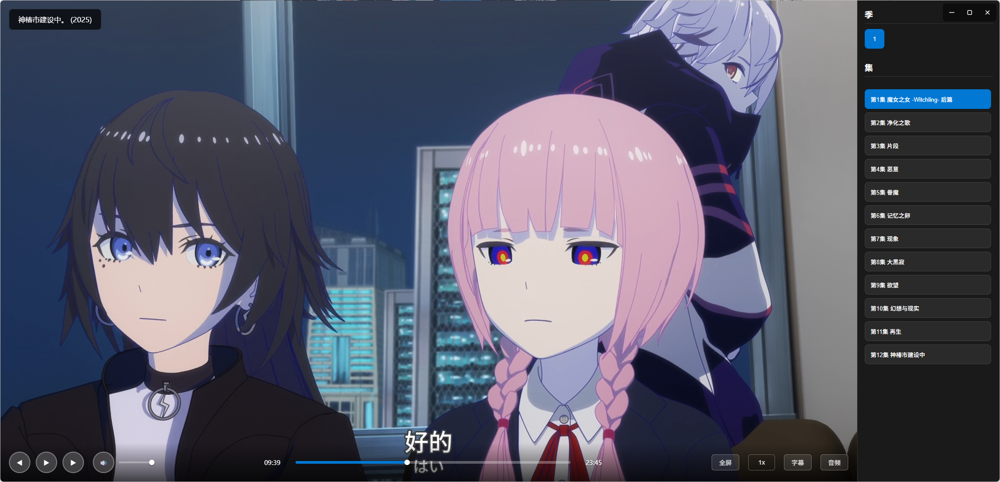

# OmniWall - 基于 Electron 的海报墙播放器

这是一个现代化的、专注于本地电视剧展示以及播放的 Electron 桌面海报墙播放器应用

> 本人没有软件开发经验，所以更新维护、功能表现可能不是非常健全，欢迎各位大佬合作开发

## 项目结构

```
OmniWall/
├── main.js          # Electron 主进程文件
├── index.html       # 渲染进程界面
├── package.json     # 项目配置和依赖
└── README.md        # 项目说明
```

## 软件功能

- 能够读取 TinyMediaManager 刮削、整理的电视剧文件夹，以海报墙的形式呈现
- 能够记录播放位置播放进度
- 能够按照各种排序方式筛选本地电视剧

## 使用方法

> 软件严格基于 TinyMediaManager 刮削、整理的电视剧文件夹，使用软件前需要使用 TinyMediaManager 刮削并且整理文件结构

设置中选择电视剧文件夹路径（与 TinyMediaManager 软件电视剧文件夹同路径），点击保存即可，ffmpeg 路径无需配置



## 应用截图





## ToDo

现存问题：

- 部分视频音频无法正常解码
- 字母位置仍未添加调节功能

预期添加的功能：

- 连接 bangumi 同步观看记录